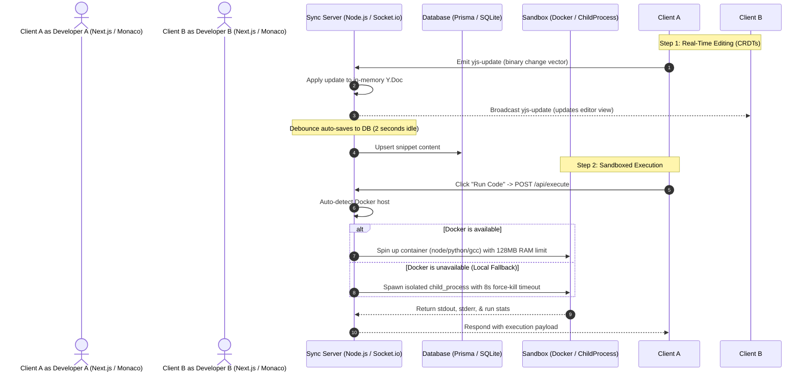

# Synapse IDE: System Architecture Overview

This document provides a technical breakdown of the architecture powering the Synapse Real-Time Collaborative Code Editor & Sandbox Execution Engine.

---

## 🗺️ System Topology Diagram

Below is the execution flow and communication layout between clients, the synchronization server, and the compiler sandboxes:

---

## 🛠️ Component Breakdown

### 1. The Frontend (Client-side)
* **Next.js & Tailwind CSS v4:** Structured with dynamic components, responsive sidebars, terminal console screens, and visual status alerts.
* **Monaco Editor (`@monaco-editor/react`):** Embedded web code editor providing syntax highlighting, brackets matching, and lint markers.
* **Yjs Document Sync Binder:** A custom sync script mapping Monaco character operations to Yjs binary updates and applying remote changes using Monaco's `setValue` and `restoreViewState` API (eliminating text jumps).

### 2. The Synchronization Backend (Server-side)
* **Express & Socket.io:** Acts as the primary WebSocket server. Express handles REST routes (`/api/auth`, `/api/room`, `/api/execute`) while Socket.io maintains room namespaces.
* **In-Memory Yjs Documents:** Keeps active collaborative rooms cached in memory for zero-lag merging of cursor edits.
* **Debounced Auto-Save:** Keystroke updates from clients are written to an in-memory document. To avoid overloading the database, a 2-second debounce timer writes the text representation back to the database only when developers pause typing.

### 3. The Execution Sandbox
* **Isolation Layer:** When a client triggers code execution, the server spins up a sandboxed runtime.
* **Docker Container Execution (Primary):** Executes code inside language-specific micro alpine-images (`node:18-alpine`, `python:3.10-alpine`, `gcc:12-alpine`, `golang:1.20-alpine`) using restricted container constraints:
  * `--memory=128m` (RAM limit to prevent heap overflow attacks)
  * `--cpus=0.5` (CPU quota limit to prevent CPU thread starvation)
* **Isolated Child Process Execution (Fallback):** Spawns child shells with hard process-group kill controls. Infinite loops (like `while True: pass`) are caught and terminated after exactly 8 seconds.

### 4. Database Schema (Prisma ORM)
Using a lightweight relational layout (running on SQLite for local development and PostgreSQL in production):

| Table | Primary Keys / Foreign Keys | Fields | Relationships |
| :--- | :--- | :--- | :--- |
| **`User`** | `id` (UUID) | `username` (Unique), `email` (Unique), `password_hash`, `created_at` | One-to-Many with `Room` (Owner) |
| **`Room`** | `id` (UUID), `owner_id` (FK) | `room_name`, `created_at` | Many-to-One with `User` (Owner), One-to-Many with `Snippet` |
| **`Snippet`** | `id` (UUID), `room_id` (FK) | `content` (TEXT), `language`, `updated_at` | Many-to-One with `Room` |
